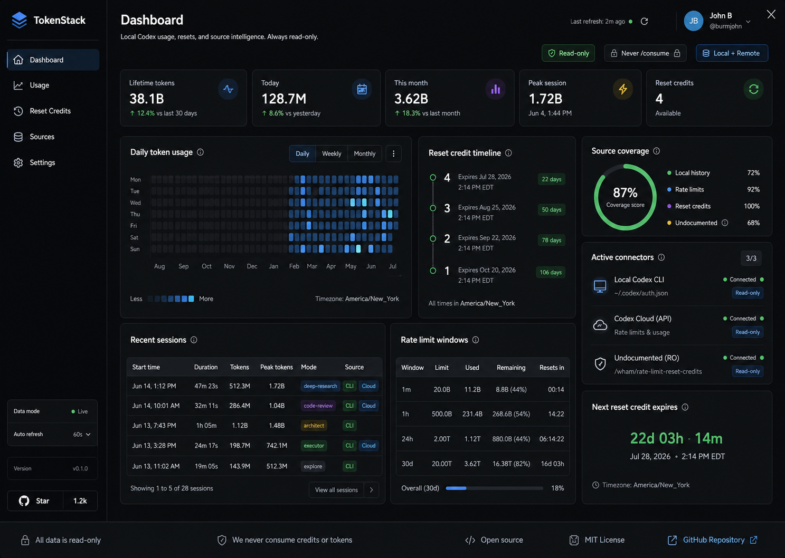
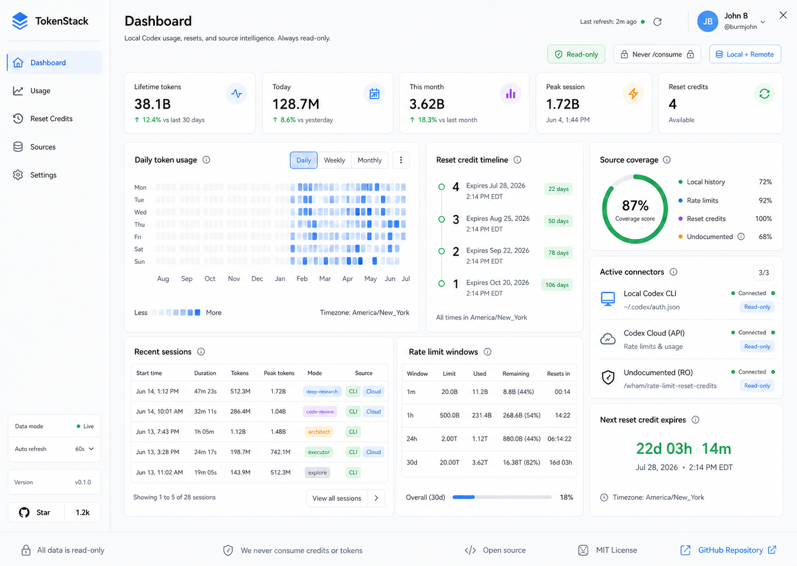

# Design SOT: TokenStack command center

Generated: July 2, 2026

This design source of truth defines the selected visual direction for
TokenStack. The app must use the Command Center direction from option 1 and
support first-class dark and light themes.

## Selected direction

The selected direction is **Command Center**. It is a dense, clean, modern
desktop dashboard with a shadcn-style component system, a persistent left
sidebar, compact status controls, high-signal token analytics, reset-credit
visibility, and clear source coverage.

Dark mode is the primary visual reference:

Light mode must preserve the same layout, hierarchy, component structure, and
information architecture:

## Product surface

TokenStack is a Windows-capable Tauri desktop app. The dashboard must feel like
a serious local developer tool, not a marketing page or generic SaaS landing
screen.

The first screen must be the usable dashboard. It must not open on a hero page,
marketing introduction, onboarding card, or empty shell.

## Layout

The app must use this dashboard structure:

- Persistent left sidebar with app identity, primary navigation, data mode,
  refresh cadence, version, and open source link affordance.
- Main dashboard header with the page title, concise subtitle, last refresh
  state, profile affordance, and safety controls.
- Top metric strip for lifetime tokens, today, this month, peak session, and
  reset credits.
- Main analytics area with daily token usage heatmap, reset-credit timeline,
  source coverage, active connectors, recent sessions, rate-limit windows, and
  next reset-credit expiration.
- Bottom safety footer that reinforces read-only behavior, no reset-credit
  consumption, open source status, license, and repository access.

## Theme requirements

The app must ship with dark and light modes. Both themes must be complete and
must use the same component structure, spacing, and hierarchy.

Dark mode must use:

- Graphite black base surface.
- Warm off-white foreground text.
- Muted blue for selected navigation and usage intensity.
- Mint green for read-only, connected, and positive status.
- Amber for warning or reset-credit urgency.
- Subtle neutral borders and restrained surface tints.

Light mode must use:

- Warm white base surface.
- White or near-white cards.
- Ink foreground text.
- Cool gray borders.
- Cobalt blue for selected navigation and usage intensity.
- Mint green for read-only, connected, and positive status.
- Amber for warning or reset-credit urgency.

Both themes must avoid decorative gradients, orbs, nested cards, browser chrome,
fake placeholder blocks, and one-note purple or blue palettes.

## Component direction

The UI must be implemented with shadcn/ui-style composition. Prefer existing
shadcn components before custom markup.

Use these component patterns:

- `Sidebar` for navigation and persistent app controls.
- `Card` for major repeated dashboard modules, with full card composition.
- `Tabs` or `ToggleGroup` for daily, weekly, and monthly views.
- `Badge` for source, status, and safety labels.
- `Chart` or a focused custom heatmap component for token activity.
- `Table` for sessions and rate-limit windows.
- `Progress` for limit and coverage indicators.
- `Tooltip` or `HoverCard` for source evidence and timestamp explanations.
- `Avatar`, `Separator`, `ScrollArea`, and `Button` where they match shadcn
  conventions.

Cards must use a radius of 8px or less. Icon buttons must use familiar icons
from the selected icon library, and buttons must keep text readable at desktop
and compact widths.

## Required visible content

The dashboard must expose these concepts in the first screen:

- `TokenStack`.
- `Dashboard`.
- `Read-only`.
- `Never /consume`.
- `Local + Remote`.
- `Daily token usage`.
- `Reset credit timeline`.
- `Source coverage`.
- `Active connectors`.
- `Undocumented (RO)`.
- `America/New_York`.
- `All data is read-only`.

Exact wording can change during implementation when a shorter label improves
clarity, but the concepts must remain visible.

## Interaction model

The dashboard must include these controls and states:

- Theme toggle for light and dark modes.
- Refresh control and visible last-refresh state.
- Data mode selector for local, remote, and combined sources.
- Daily, weekly, and monthly usage view controls.
- Source coverage explanation on hover or inspector affordance.
- Read-only guard status that makes unsafe behavior impossible and visible.
- Connector status rows for local Codex history, known read-only endpoints, and
  undocumented read-only endpoints.

## Accessibility and polish

The design must be keyboard usable, screen-reader friendly, and responsive
inside normal desktop window sizes. Theme colors must keep readable contrast for
text, icons, borders, charts, badges, and status chips.

The implementation must preserve the calm density of the selected concept:
compact, scan-friendly, data-rich, and precise without becoming cramped.

