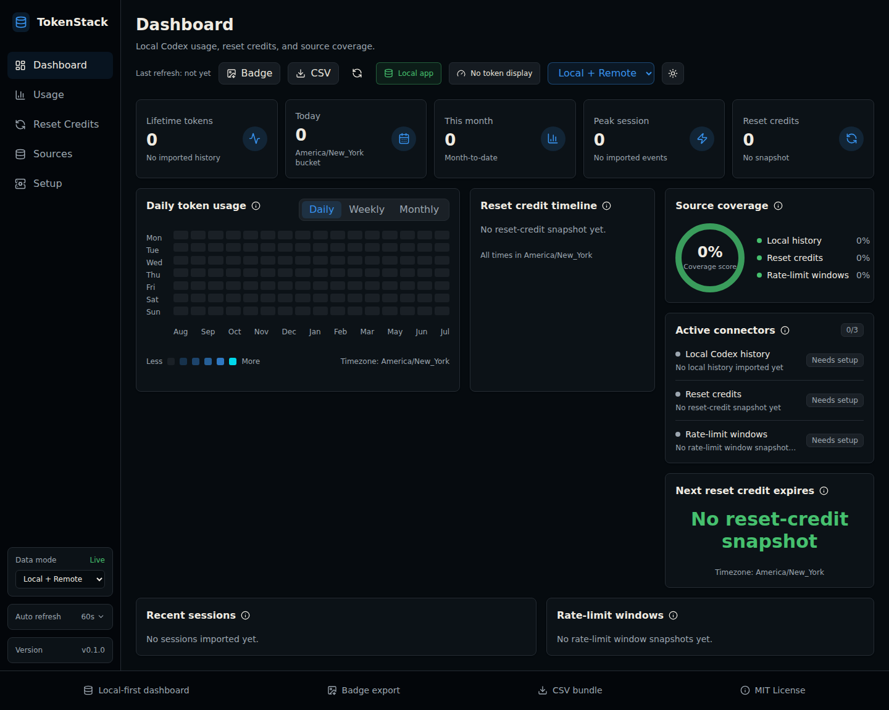
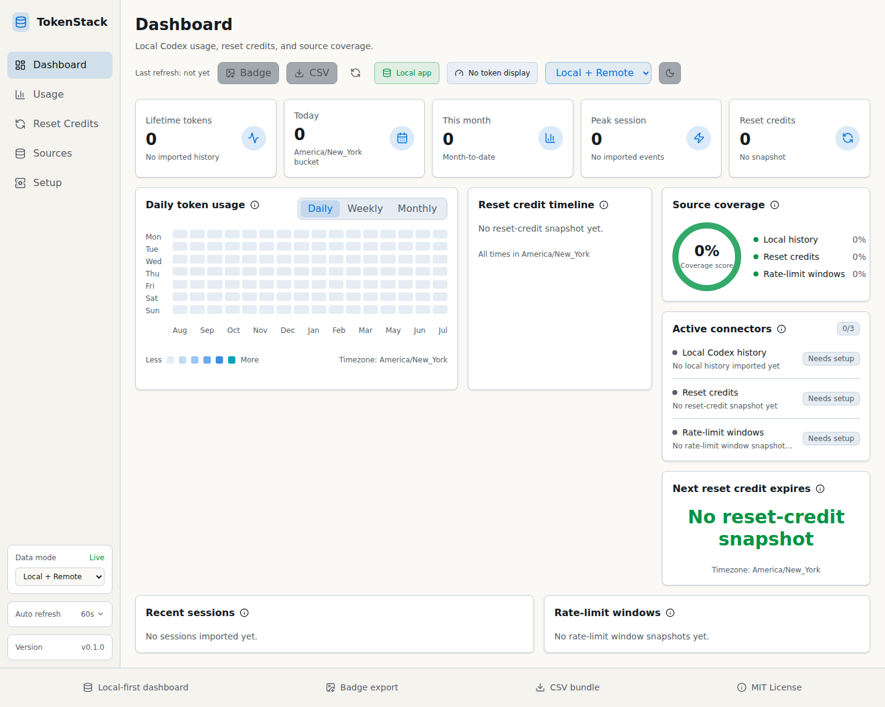

# TokenStack

TokenStack is a local desktop command center for Codex usage, reset-credit visibility, source coverage, and shareable exports. It is a Tauri app with a Rust data layer, React dashboard, SQLite persistence, and test fixtures that stay out of production dashboard data.





## What It Shows

- Local Codex usage metrics from imported history.
- Reset-credit snapshots when available.
- Rate-limit window snapshots when available.
- Source coverage and confidence for each dashboard metric.
- PNG badge exports and CSV usage bundles from the validated dashboard summary.

## Development

```sh
pnpm install
pnpm dev
pnpm tauri:dev
```

## Verification

```sh
pnpm lint
pnpm typecheck
pnpm test
pnpm test:browser
pnpm secret:scan
pnpm fixture:scan
pnpm build
cargo test --manifest-path src-tauri/Cargo.toml
cargo clippy --manifest-path src-tauri/Cargo.toml -- -D warnings
cargo fmt --manifest-path src-tauri/Cargo.toml --check
```

Windows packaging is configured for Tauri NSIS output. A Windows runner should execute:

```sh
pnpm install
pnpm exec tauri build --target x86_64-pc-windows-msvc
```

## Data Sources

TokenStack imports Codex history from local JSONL files and refreshes available reset-credit and rate-limit snapshots through the desktop app.

## Privacy Summary

TokenStack runs locally and summarizes usage without exposing auth tokens or raw credential data. Tests use fixtures; the app does not use fixture values for real dashboard metrics.

## License

MIT. See [LICENSE](LICENSE) and [docs/adr/0000-license.md](docs/adr/0000-license.md).
